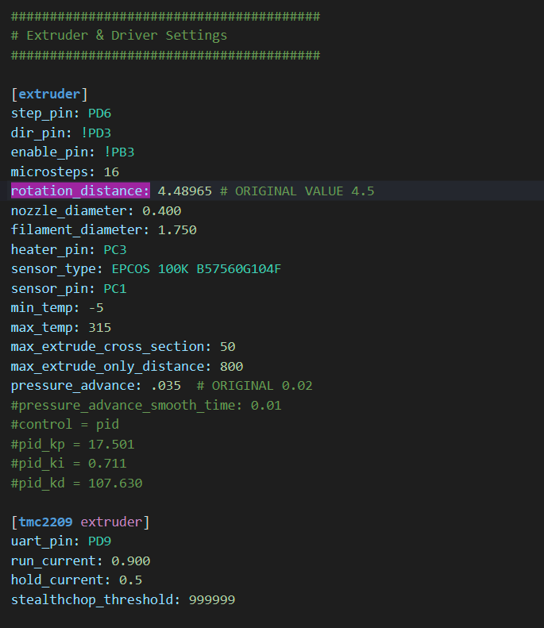
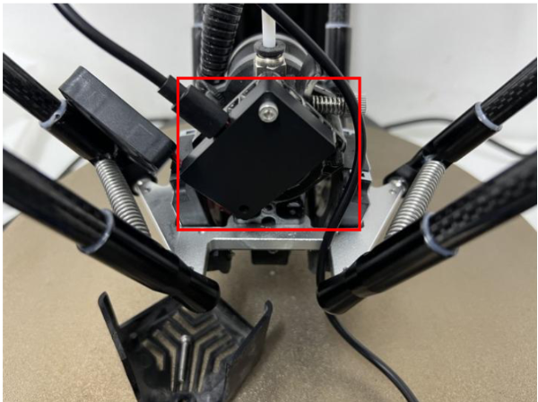

# Calibration

### Links to calibration information
* Official Klipper Documentation contains a wealth of calibration/configuration knowledge
  * https://www.klipper3d.org/
* A great guide to tuning and calibration. (This somewhat contradicts the "flow cube" calibration technique)
    * https://ellis3dp.com/Print-Tuning-Guide/articles/first_layer_squish.html

* Use the Flow cube to fine tune after calibrating rotational distance
    * https://www.3dmakerengineering.com/blogs/3d-printing/flow-rate-calibration

* Good info on z-offset calibration
  * https://www.3dmakerengineering.com/blogs/3d-printing/bed-leveling-first-layer-thickness-and-z-offset

### E Step/ Rotational Distance Calibration

The default rotational distance value shipped with the v400 is 4.5

* Calibrate using the official Klipper documentation
   * https://www.klipper3d.org/Rotation_Distance.html  

  I use 120 mm instead of the 70 mm and extrude 100mm instead of 50
  The G-code command I use is : <B>G1 E100 F100</B>
 

* An E-STEP complete guide (I use it as a reference since it is not geared towards a Klipper based machine but full of good info)
    * https://www.3dsourced.com/guides/how-to-calibrate-e-steps-on-extruder/
 
 

* Update your Klipper printer.cfg with the calculated rotational distance (shown below)

      

 

### Delta Calibration
* https://www.klipper3d.org/Delta_Calibrate.html

### Enhanced Delta Calibration

* See the Delta Calibration link for detailed instructions.
* Model: [Delta calibration Model](../models/calibration/DELTA_calibrate_size.stl)
* Spreadsheet to calculate the enhanced delta calibration G-code commands 
    * [Enhanced Delta Spreadsheet](./EnhancedDeltaWorksheet.xlsx)

### Pressure Advance Calibration
* See https://www.klipper3d.org/Pressure_Advance.html
* Model: [Pressure Advance Model](../models\calibration\square_tower.stl)

### Resonance Calibration using the Flsun accelerometer
Install the Flsun adxl to the extruder according the flsun install document 
https://github.com/Flsun3d/Flsun-V400/blob/main/V400%20Pad%EF%BC%88V1.3%EF%BC%89Adxl345%20usage%20tutorial.pdf

1st, If your are using the official Klipper software, you need to install the required libraries

 - ssh into the speeder-pad and perform the following actions
    - >ssh pi@speeder-pad (or IP address if hostname does not work)
    - >sudo apt update
    - >sudo apt install python3-numpy python3-matplotlib libatlas-base-dev
    - >~/klippy-env/bin/pip install -v numpy

The default install document linked above works fine after flashing the stock Flsun Speeder-pad image, however when running "stock" Klipper, it is necessary to configure the system slightly differently.
I used the stock asxl345.cfg settings from Flsun (recreated from the above .pdf).

Instead of using the serial settings outlined in the PDF, it is necessary to query for the correct address
Do the following
>ssh pi@speeder-pad (or IP address if hostname does not work)
>ls /dev/serial/by-id/*

Copy the address returned. NOTE: your printer will also be listed in addtion to any other USB devices connected. 
ex.
Connected to the 3rd USB Port, the flsun adxl345's location was:
>/dev/serial/by-id/usb-Klipper_stm32f103xe_5B2A393138360B0036343231-if00 
(It the adxl345 should have 'stm32f103xe' in the address, your printer will not)

This address then gets added to the adxl345.cfg config file (create if its not already part of your configs using the mainsail interface "machine" menu)

>[mcu adxl345Mcu]
serial: /dev/serial/by-id/usb-Klipper_stm32f103xe_5B2A393138360B0036343231-if00
[adxl345] 
cs_pin: adxl345Mcu :PA4
spi_bus: spi1
[resonance_tester]
accel_chip: adxl345
probe_points: 0, 0, 20

Once saved enable it in you printer.cfg file by adding the line:
>[include adxl345_flsun.cfg]

You can then click "Save and Restart" for the changes to take effect.

I then simply followed the Klipper documentation for setting up/calibrating using the accelerometer located at https://www.klipper3d.org/Measuring_Resonances.html#input-shaper-auto-calibration

You can quickly check if the adxl is connected by using the speeder-pad screen and accessing the input shaper calibration screen. 

Once complete, you should disable the adxl by commenting out the line [include adxl345.cfg] in your printer.cfg

